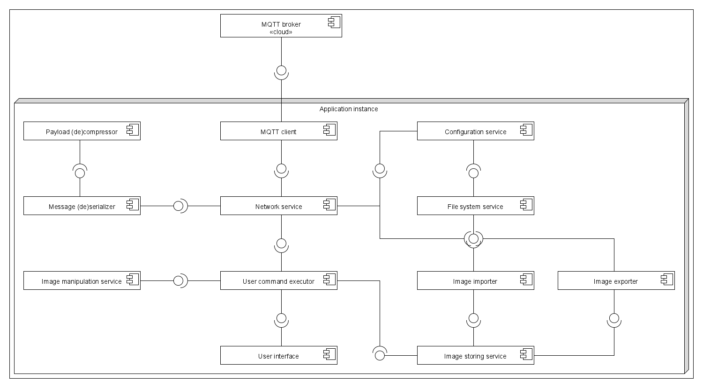

# DrawTogether

DrawTogether is a collaborative cross-platform  drawing application.
You can draw on a shared canvas with your friends with realtime sharing between clients.

## Dependencies

### Compiler
The used compiler must have C++20 support!

#### Windows
We recommend MSVC because MinGW has a bug which prevents OpenSSL's recipe to build.

#### Linux
On linux you can use GCC or Clang.

### Conan
Conan is needed to install the dependencies. It can be installed with pip: ``pip install conan``

For other download options please visit: https://conan.io/downloads.html

#### Download and build dependencies
If you are fine using the default compiler you can use the install-dependencies.bat/.sh files.

If you want to change the used compiler or conan asks you to specify compiler settings use the following commands:

    > cd build
    build> conan install .. --build missing -s compiler=COMPILER_NAME -s compiler.libcxx=STDLIB_NAME -s compiler.version=COMPILER_VERSION

- COMPILER_NAME: The selected compiler (gcc/clang/msvc)
- STDLIB_NAME:
    - GCC: libstdc++11
    - Clang/LLVM: libc++
    - MSVC: libc++

## Architecture

### User interface
The user can use the graphical user interface to make changes of the image or load and save it.
The user also uses this interface to start and monitor the shared session.

### User command executor
Inputs of the user is forwarded to this component, which decides service or services and in what order is needed to accomplish the command given by the user.

A callback is also sent to the user interface notifying it about the result of the action.

### Image storing service
This service is providing a united interface to use components image importer and image exporter.

### Image importer
This component is interfacing with the filesystem service and convert the image file to internal format.

### Image exporter
This component is interfacing with the filesystem service and convert the internal format to image file.

### Filesystem service
This service provides a high level interface to the filesystem.

### Configuration service
This service is responsible to read, write and modify the configuration data of the application.

### Image manipulation service
This service can be considered the most important component of the application, it is responsible for making changes on the image.

### Network service
This service provides a high level interface to communicate with other clients in the session.

### Message (de)serializer
This component is responsible for converting the internal working format to a small packet that can be sent over the network.

### Payload (de)compressor
This component is taking the message payload and compresses it to a smaller size or takes the compressed payload and uncompresses it.

### MQTT client
This component functions as the entry and exit point for the application from the network stack.

After initializing the connection it sends and receives messages to and from the MQTT broker. 